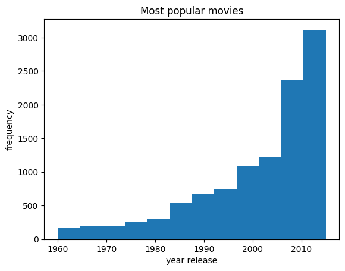
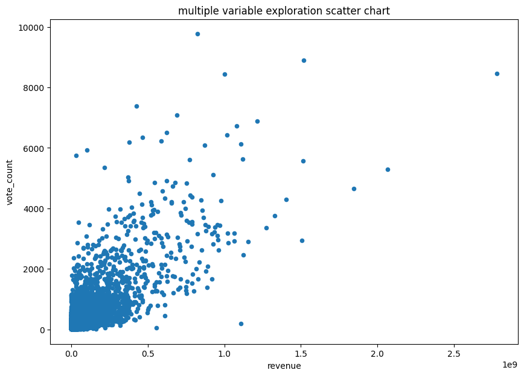

# Project Description

The project, based on the TMDb_movie dataset, analyzes movies released within a specific timeframe. With 21 features under examination, the focus is on identifying significant trends, especially pertaining to viewers' preferences for production companies, vote counts for the top production company, and factors influencing movie popularity.

## Key Questions

1. Which production companies garnered the most viewer interest?
2. What were the vote counts for the top production company during the specified period?
3. What factors influenced the popularity of movies in the dataset?

## Methodology

The project utilizes the "import" command to access dictionaries for detailed exploration. Aliases like "np," "pd," and "plt" are used for libraries such as NumPy, Pandas, and Matplotlib to enhance code readability. The dataset is represented as a dataframe ("df") for efficient analysis and reporting.


```python
import numpy as np 
import pandas as pd 
import matplotlib.pyplot as plt

```


```python
df_movies = pd.read_csv('tmdb-movies.csv')
```


```python
df_movies.describe()
```


<div>
<style scoped>
    .dataframe tbody tr th:only-of-type {
        vertical-align: middle;
    }

    .dataframe tbody tr th {
        vertical-align: top;
    }

    .dataframe thead th {
        text-align: right;
    }
</style>
<table border="1" class="dataframe">
  <thead>
    <tr style="text-align: right;">
      <th></th>
      <th>id</th>
      <th>popularity</th>
      <th>budget</th>
      <th>revenue</th>
      <th>runtime</th>
      <th>vote_count</th>
      <th>vote_average</th>
      <th>release_year</th>
      <th>budget_adj</th>
      <th>revenue_adj</th>
    </tr>
  </thead>
  <tbody>
    <tr>
      <th>count</th>
      <td>10866.000000</td>
      <td>10866.000000</td>
      <td>1.086600e+04</td>
      <td>1.086600e+04</td>
      <td>10866.000000</td>
      <td>10866.000000</td>
      <td>10866.000000</td>
      <td>10866.000000</td>
      <td>1.086600e+04</td>
      <td>1.086600e+04</td>
    </tr>
    <tr>
      <th>mean</th>
      <td>66064.177434</td>
      <td>0.646441</td>
      <td>1.462570e+07</td>
      <td>3.982332e+07</td>
      <td>102.070863</td>
      <td>217.389748</td>
      <td>5.974922</td>
      <td>2001.322658</td>
      <td>1.755104e+07</td>
      <td>5.136436e+07</td>
    </tr>
    <tr>
      <th>std</th>
      <td>92130.136561</td>
      <td>1.000185</td>
      <td>3.091321e+07</td>
      <td>1.170035e+08</td>
      <td>31.381405</td>
      <td>575.619058</td>
      <td>0.935142</td>
      <td>12.812941</td>
      <td>3.430616e+07</td>
      <td>1.446325e+08</td>
    </tr>
    <tr>
      <th>min</th>
      <td>5.000000</td>
      <td>0.000065</td>
      <td>0.000000e+00</td>
      <td>0.000000e+00</td>
      <td>0.000000</td>
      <td>10.000000</td>
      <td>1.500000</td>
      <td>1960.000000</td>
      <td>0.000000e+00</td>
      <td>0.000000e+00</td>
    </tr>
    <tr>
      <th>25%</th>
      <td>10596.250000</td>
      <td>0.207583</td>
      <td>0.000000e+00</td>
      <td>0.000000e+00</td>
      <td>90.000000</td>
      <td>17.000000</td>
      <td>5.400000</td>
      <td>1995.000000</td>
      <td>0.000000e+00</td>
      <td>0.000000e+00</td>
    </tr>
    <tr>
      <th>50%</th>
      <td>20669.000000</td>
      <td>0.383856</td>
      <td>0.000000e+00</td>
      <td>0.000000e+00</td>
      <td>99.000000</td>
      <td>38.000000</td>
      <td>6.000000</td>
      <td>2006.000000</td>
      <td>0.000000e+00</td>
      <td>0.000000e+00</td>
    </tr>
    <tr>
      <th>75%</th>
      <td>75610.000000</td>
      <td>0.713817</td>
      <td>1.500000e+07</td>
      <td>2.400000e+07</td>
      <td>111.000000</td>
      <td>145.750000</td>
      <td>6.600000</td>
      <td>2011.000000</td>
      <td>2.085325e+07</td>
      <td>3.369710e+07</td>
    </tr>
    <tr>
      <th>max</th>
      <td>417859.000000</td>
      <td>32.985763</td>
      <td>4.250000e+08</td>
      <td>2.781506e+09</td>
      <td>900.000000</td>
      <td>9767.000000</td>
      <td>9.200000</td>
      <td>2015.000000</td>
      <td>4.250000e+08</td>
      <td>2.827124e+09</td>
    </tr>
  </tbody>
</table>
</div>


```python
df_movies.info()
```

    <class 'pandas.core.frame.DataFrame'>
    RangeIndex: 10866 entries, 0 to 10865
    Data columns (total 21 columns):
     #   Column                Non-Null Count  Dtype  
    ---  ------                --------------  -----  
     0   id                    10866 non-null  int64  
     1   imdb_id               10856 non-null  object 
     2   popularity            10866 non-null  float64
     3   budget                10866 non-null  int64  
     4   revenue               10866 non-null  int64  
     5   original_title        10866 non-null  object 
     6   cast                  10790 non-null  object 
     7   homepage              2936 non-null   object 
     8   director              10822 non-null  object 
     9   tagline               8042 non-null   object 
     10  keywords              9373 non-null   object 
     11  overview              10862 non-null  object 
     12  runtime               10866 non-null  int64  
     13  genres                10843 non-null  object 
     14  production_companies  9836 non-null   object 
     15  release_date          10866 non-null  object 
     16  vote_count            10866 non-null  int64  
     17  vote_average          10866 non-null  float64
     18  release_year          10866 non-null  int64  
     19  budget_adj            10866 non-null  float64
     20  revenue_adj           10866 non-null  float64
    dtypes: float64(4), int64(6), object(11)
    memory usage: 1.7+ MB
    

It can be seen the that the dataframe contains 20 features and each showing that memory usage and the number of non- nulls in each cell.


```python
df_movies.head(12)
```


<div>
<style scoped>
    .dataframe tbody tr th:only-of-type {
        vertical-align: middle;
    }

    .dataframe tbody tr th {
        vertical-align: top;
    }

    .dataframe thead th {
        text-align: right;
    }
</style>
<table border="1" class="dataframe">
  <thead>
    <tr style="text-align: right;">
      <th></th>
      <th>id</th>
      <th>imdb_id</th>
      <th>popularity</th>
      <th>budget</th>
      <th>revenue</th>
      <th>original_title</th>
      <th>cast</th>
      <th>homepage</th>
      <th>director</th>
      <th>tagline</th>
      <th>...</th>
      <th>overview</th>
      <th>runtime</th>
      <th>genres</th>
      <th>production_companies</th>
      <th>release_date</th>
      <th>vote_count</th>
      <th>vote_average</th>
      <th>release_year</th>
      <th>budget_adj</th>
      <th>revenue_adj</th>
    </tr>
  </thead>
  <tbody>
    <tr>
      <th>0</th>
      <td>135397</td>
      <td>tt0369610</td>
      <td>32.985763</td>
      <td>150000000</td>
      <td>1513528810</td>
      <td>Jurassic World</td>
      <td>Chris Pratt|Bryce Dallas Howard|Irrfan Khan|Vi...</td>
      <td>http://www.jurassicworld.com/</td>
      <td>Colin Trevorrow</td>
      <td>The park is open.</td>
      <td>...</td>
      <td>Twenty-two years after the events of Jurassic ...</td>
      <td>124</td>
      <td>Action|Adventure|Science Fiction|Thriller</td>
      <td>Universal Studios|Amblin Entertainment|Legenda...</td>
      <td>6/9/15</td>
      <td>5562</td>
      <td>6.5</td>
      <td>2015</td>
      <td>1.379999e+08</td>
      <td>1.392446e+09</td>
    </tr>
    <tr>
      <th>1</th>
      <td>76341</td>
      <td>tt1392190</td>
      <td>28.419936</td>
      <td>150000000</td>
      <td>378436354</td>
      <td>Mad Max: Fury Road</td>
      <td>Tom Hardy|Charlize Theron|Hugh Keays-Byrne|Nic...</td>
      <td>http://www.madmaxmovie.com/</td>
      <td>George Miller</td>
      <td>What a Lovely Day.</td>
      <td>...</td>
      <td>An apocalyptic story set in the furthest reach...</td>
      <td>120</td>
      <td>Action|Adventure|Science Fiction|Thriller</td>
      <td>Village Roadshow Pictures|Kennedy Miller Produ...</td>
      <td>5/13/15</td>
      <td>6185</td>
      <td>7.1</td>
      <td>2015</td>
      <td>1.379999e+08</td>
      <td>3.481613e+08</td>
    </tr>
    <tr>
      <th>2</th>
      <td>262500</td>
      <td>tt2908446</td>
      <td>13.112507</td>
      <td>110000000</td>
      <td>295238201</td>
      <td>Insurgent</td>
      <td>Shailene Woodley|Theo James|Kate Winslet|Ansel...</td>
      <td>http://www.thedivergentseries.movie/#insurgent</td>
      <td>Robert Schwentke</td>
      <td>One Choice Can Destroy You</td>
      <td>...</td>
      <td>Beatrice Prior must confront her inner demons ...</td>
      <td>119</td>
      <td>Adventure|Science Fiction|Thriller</td>
      <td>Summit Entertainment|Mandeville Films|Red Wago...</td>
      <td>3/18/15</td>
      <td>2480</td>
      <td>6.3</td>
      <td>2015</td>
      <td>1.012000e+08</td>
      <td>2.716190e+08</td>
    </tr>
    <tr>
      <th>3</th>
      <td>140607</td>
      <td>tt2488496</td>
      <td>11.173104</td>
      <td>200000000</td>
      <td>2068178225</td>
      <td>Star Wars: The Force Awakens</td>
      <td>Harrison Ford|Mark Hamill|Carrie Fisher|Adam D...</td>
      <td>http://www.starwars.com/films/star-wars-episod...</td>
      <td>J.J. Abrams</td>
      <td>Every generation has a story.</td>
      <td>...</td>
      <td>Thirty years after defeating the Galactic Empi...</td>
      <td>136</td>
      <td>Action|Adventure|Science Fiction|Fantasy</td>
      <td>Lucasfilm|Truenorth Productions|Bad Robot</td>
      <td>12/15/15</td>
      <td>5292</td>
      <td>7.5</td>
      <td>2015</td>
      <td>1.839999e+08</td>
      <td>1.902723e+09</td>
    </tr>
    <tr>
      <th>4</th>
      <td>168259</td>
      <td>tt2820852</td>
      <td>9.335014</td>
      <td>190000000</td>
      <td>1506249360</td>
      <td>Furious 7</td>
      <td>Vin Diesel|Paul Walker|Jason Statham|Michelle ...</td>
      <td>http://www.furious7.com/</td>
      <td>James Wan</td>
      <td>Vengeance Hits Home</td>
      <td>...</td>
      <td>Deckard Shaw seeks revenge against Dominic Tor...</td>
      <td>137</td>
      <td>Action|Crime|Thriller</td>
      <td>Universal Pictures|Original Film|Media Rights ...</td>
      <td>4/1/15</td>
      <td>2947</td>
      <td>7.3</td>
      <td>2015</td>
      <td>1.747999e+08</td>
      <td>1.385749e+09</td>
    </tr>
    <tr>
      <th>5</th>
      <td>281957</td>
      <td>tt1663202</td>
      <td>9.110700</td>
      <td>135000000</td>
      <td>532950503</td>
      <td>The Revenant</td>
      <td>Leonardo DiCaprio|Tom Hardy|Will Poulter|Domhn...</td>
      <td>http://www.foxmovies.com/movies/the-revenant</td>
      <td>Alejandro González Iñárritu</td>
      <td>(n. One who has returned, as if from the dead.)</td>
      <td>...</td>
      <td>In the 1820s, a frontiersman, Hugh Glass, sets...</td>
      <td>156</td>
      <td>Western|Drama|Adventure|Thriller</td>
      <td>Regency Enterprises|Appian Way|CatchPlay|Anony...</td>
      <td>12/25/15</td>
      <td>3929</td>
      <td>7.2</td>
      <td>2015</td>
      <td>1.241999e+08</td>
      <td>4.903142e+08</td>
    </tr>
    <tr>
      <th>6</th>
      <td>87101</td>
      <td>tt1340138</td>
      <td>8.654359</td>
      <td>155000000</td>
      <td>440603537</td>
      <td>Terminator Genisys</td>
      <td>Arnold Schwarzenegger|Jason Clarke|Emilia Clar...</td>
      <td>http://www.terminatormovie.com/</td>
      <td>Alan Taylor</td>
      <td>Reset the future</td>
      <td>...</td>
      <td>The year is 2029. John Connor, leader of the r...</td>
      <td>125</td>
      <td>Science Fiction|Action|Thriller|Adventure</td>
      <td>Paramount Pictures|Skydance Productions</td>
      <td>6/23/15</td>
      <td>2598</td>
      <td>5.8</td>
      <td>2015</td>
      <td>1.425999e+08</td>
      <td>4.053551e+08</td>
    </tr>
    <tr>
      <th>7</th>
      <td>286217</td>
      <td>tt3659388</td>
      <td>7.667400</td>
      <td>108000000</td>
      <td>595380321</td>
      <td>The Martian</td>
      <td>Matt Damon|Jessica Chastain|Kristen Wiig|Jeff ...</td>
      <td>http://www.foxmovies.com/movies/the-martian</td>
      <td>Ridley Scott</td>
      <td>Bring Him Home</td>
      <td>...</td>
      <td>During a manned mission to Mars, Astronaut Mar...</td>
      <td>141</td>
      <td>Drama|Adventure|Science Fiction</td>
      <td>Twentieth Century Fox Film Corporation|Scott F...</td>
      <td>9/30/15</td>
      <td>4572</td>
      <td>7.6</td>
      <td>2015</td>
      <td>9.935996e+07</td>
      <td>5.477497e+08</td>
    </tr>
    <tr>
      <th>8</th>
      <td>211672</td>
      <td>tt2293640</td>
      <td>7.404165</td>
      <td>74000000</td>
      <td>1156730962</td>
      <td>Minions</td>
      <td>Sandra Bullock|Jon Hamm|Michael Keaton|Allison...</td>
      <td>http://www.minionsmovie.com/</td>
      <td>Kyle Balda|Pierre Coffin</td>
      <td>Before Gru, they had a history of bad bosses</td>
      <td>...</td>
      <td>Minions Stuart, Kevin and Bob are recruited by...</td>
      <td>91</td>
      <td>Family|Animation|Adventure|Comedy</td>
      <td>Universal Pictures|Illumination Entertainment</td>
      <td>6/17/15</td>
      <td>2893</td>
      <td>6.5</td>
      <td>2015</td>
      <td>6.807997e+07</td>
      <td>1.064192e+09</td>
    </tr>
    <tr>
      <th>9</th>
      <td>150540</td>
      <td>tt2096673</td>
      <td>6.326804</td>
      <td>175000000</td>
      <td>853708609</td>
      <td>Inside Out</td>
      <td>Amy Poehler|Phyllis Smith|Richard Kind|Bill Ha...</td>
      <td>http://movies.disney.com/inside-out</td>
      <td>Pete Docter</td>
      <td>Meet the little voices inside your head.</td>
      <td>...</td>
      <td>Growing up can be a bumpy road, and it's no ex...</td>
      <td>94</td>
      <td>Comedy|Animation|Family</td>
      <td>Walt Disney Pictures|Pixar Animation Studios|W...</td>
      <td>6/9/15</td>
      <td>3935</td>
      <td>8.0</td>
      <td>2015</td>
      <td>1.609999e+08</td>
      <td>7.854116e+08</td>
    </tr>
    <tr>
      <th>10</th>
      <td>206647</td>
      <td>tt2379713</td>
      <td>6.200282</td>
      <td>245000000</td>
      <td>880674609</td>
      <td>Spectre</td>
      <td>Daniel Craig|Christoph Waltz|Léa Seydoux|Ralp...</td>
      <td>http://www.sonypictures.com/movies/spectre/</td>
      <td>Sam Mendes</td>
      <td>A Plan No One Escapes</td>
      <td>...</td>
      <td>A cryptic message from Bond’s past sends him...</td>
      <td>148</td>
      <td>Action|Adventure|Crime</td>
      <td>Columbia Pictures|Danjaq|B24</td>
      <td>10/26/15</td>
      <td>3254</td>
      <td>6.2</td>
      <td>2015</td>
      <td>2.253999e+08</td>
      <td>8.102203e+08</td>
    </tr>
    <tr>
      <th>11</th>
      <td>76757</td>
      <td>tt1617661</td>
      <td>6.189369</td>
      <td>176000003</td>
      <td>183987723</td>
      <td>Jupiter Ascending</td>
      <td>Mila Kunis|Channing Tatum|Sean Bean|Eddie Redm...</td>
      <td>http://www.jupiterascending.com</td>
      <td>Lana Wachowski|Lilly Wachowski</td>
      <td>Expand your universe.</td>
      <td>...</td>
      <td>In a universe where human genetic material is ...</td>
      <td>124</td>
      <td>Science Fiction|Fantasy|Action|Adventure</td>
      <td>Village Roadshow Pictures|Dune Entertainment|A...</td>
      <td>2/4/15</td>
      <td>1937</td>
      <td>5.2</td>
      <td>2015</td>
      <td>1.619199e+08</td>
      <td>1.692686e+08</td>
    </tr>
  </tbody>
</table>
<p>12 rows × 21 columns</p>
</div>


```python
# Removing duplicates
def_duplicates = df_movies.drop_duplicates()
def_duplicates
```


<div>
<style scoped>
    .dataframe tbody tr th:only-of-type {
        vertical-align: middle;
    }

    .dataframe tbody tr th {
        vertical-align: top;
    }

    .dataframe thead th {
        text-align: right;
    }
</style>
<table border="1" class="dataframe">
  <thead>
    <tr style="text-align: right;">
      <th></th>
      <th>id</th>
      <th>imdb_id</th>
      <th>popularity</th>
      <th>budget</th>
      <th>revenue</th>
      <th>original_title</th>
      <th>cast</th>
      <th>homepage</th>
      <th>director</th>
      <th>tagline</th>
      <th>...</th>
      <th>overview</th>
      <th>runtime</th>
      <th>genres</th>
      <th>production_companies</th>
      <th>release_date</th>
      <th>vote_count</th>
      <th>vote_average</th>
      <th>release_year</th>
      <th>budget_adj</th>
      <th>revenue_adj</th>
    </tr>
  </thead>
  <tbody>
    <tr>
      <th>0</th>
      <td>135397</td>
      <td>tt0369610</td>
      <td>32.985763</td>
      <td>150000000</td>
      <td>1513528810</td>
      <td>Jurassic World</td>
      <td>Chris Pratt|Bryce Dallas Howard|Irrfan Khan|Vi...</td>
      <td>http://www.jurassicworld.com/</td>
      <td>Colin Trevorrow</td>
      <td>The park is open.</td>
      <td>...</td>
      <td>Twenty-two years after the events of Jurassic ...</td>
      <td>124</td>
      <td>Action|Adventure|Science Fiction|Thriller</td>
      <td>Universal Studios|Amblin Entertainment|Legenda...</td>
      <td>6/9/15</td>
      <td>5562</td>
      <td>6.5</td>
      <td>2015</td>
      <td>1.379999e+08</td>
      <td>1.392446e+09</td>
    </tr>
    <tr>
      <th>1</th>
      <td>76341</td>
      <td>tt1392190</td>
      <td>28.419936</td>
      <td>150000000</td>
      <td>378436354</td>
      <td>Mad Max: Fury Road</td>
      <td>Tom Hardy|Charlize Theron|Hugh Keays-Byrne|Nic...</td>
      <td>http://www.madmaxmovie.com/</td>
      <td>George Miller</td>
      <td>What a Lovely Day.</td>
      <td>...</td>
      <td>An apocalyptic story set in the furthest reach...</td>
      <td>120</td>
      <td>Action|Adventure|Science Fiction|Thriller</td>
      <td>Village Roadshow Pictures|Kennedy Miller Produ...</td>
      <td>5/13/15</td>
      <td>6185</td>
      <td>7.1</td>
      <td>2015</td>
      <td>1.379999e+08</td>
      <td>3.481613e+08</td>
    </tr>
    <tr>
      <th>2</th>
      <td>262500</td>
      <td>tt2908446</td>
      <td>13.112507</td>
      <td>110000000</td>
      <td>295238201</td>
      <td>Insurgent</td>
      <td>Shailene Woodley|Theo James|Kate Winslet|Ansel...</td>
      <td>http://www.thedivergentseries.movie/#insurgent</td>
      <td>Robert Schwentke</td>
      <td>One Choice Can Destroy You</td>
      <td>...</td>
      <td>Beatrice Prior must confront her inner demons ...</td>
      <td>119</td>
      <td>Adventure|Science Fiction|Thriller</td>
      <td>Summit Entertainment|Mandeville Films|Red Wago...</td>
      <td>3/18/15</td>
      <td>2480</td>
      <td>6.3</td>
      <td>2015</td>
      <td>1.012000e+08</td>
      <td>2.716190e+08</td>
    </tr>
    <tr>
      <th>3</th>
      <td>140607</td>
      <td>tt2488496</td>
      <td>11.173104</td>
      <td>200000000</td>
      <td>2068178225</td>
      <td>Star Wars: The Force Awakens</td>
      <td>Harrison Ford|Mark Hamill|Carrie Fisher|Adam D...</td>
      <td>http://www.starwars.com/films/star-wars-episod...</td>
      <td>J.J. Abrams</td>
      <td>Every generation has a story.</td>
      <td>...</td>
      <td>Thirty years after defeating the Galactic Empi...</td>
      <td>136</td>
      <td>Action|Adventure|Science Fiction|Fantasy</td>
      <td>Lucasfilm|Truenorth Productions|Bad Robot</td>
      <td>12/15/15</td>
      <td>5292</td>
      <td>7.5</td>
      <td>2015</td>
      <td>1.839999e+08</td>
      <td>1.902723e+09</td>
    </tr>
    <tr>
      <th>4</th>
      <td>168259</td>
      <td>tt2820852</td>
      <td>9.335014</td>
      <td>190000000</td>
      <td>1506249360</td>
      <td>Furious 7</td>
      <td>Vin Diesel|Paul Walker|Jason Statham|Michelle ...</td>
      <td>http://www.furious7.com/</td>
      <td>James Wan</td>
      <td>Vengeance Hits Home</td>
      <td>...</td>
      <td>Deckard Shaw seeks revenge against Dominic Tor...</td>
      <td>137</td>
      <td>Action|Crime|Thriller</td>
      <td>Universal Pictures|Original Film|Media Rights ...</td>
      <td>4/1/15</td>
      <td>2947</td>
      <td>7.3</td>
      <td>2015</td>
      <td>1.747999e+08</td>
      <td>1.385749e+09</td>
    </tr>
    <tr>
      <th>...</th>
      <td>...</td>
      <td>...</td>
      <td>...</td>
      <td>...</td>
      <td>...</td>
      <td>...</td>
      <td>...</td>
      <td>...</td>
      <td>...</td>
      <td>...</td>
      <td>...</td>
      <td>...</td>
      <td>...</td>
      <td>...</td>
      <td>...</td>
      <td>...</td>
      <td>...</td>
      <td>...</td>
      <td>...</td>
      <td>...</td>
      <td>...</td>
    </tr>
    <tr>
      <th>10861</th>
      <td>21</td>
      <td>tt0060371</td>
      <td>0.080598</td>
      <td>0</td>
      <td>0</td>
      <td>The Endless Summer</td>
      <td>Michael Hynson|Robert August|Lord 'Tally Ho' B...</td>
      <td>NaN</td>
      <td>Bruce Brown</td>
      <td>NaN</td>
      <td>...</td>
      <td>The Endless Summer, by Bruce Brown, is one of ...</td>
      <td>95</td>
      <td>Documentary</td>
      <td>Bruce Brown Films</td>
      <td>6/15/66</td>
      <td>11</td>
      <td>7.4</td>
      <td>1966</td>
      <td>0.000000e+00</td>
      <td>0.000000e+00</td>
    </tr>
    <tr>
      <th>10862</th>
      <td>20379</td>
      <td>tt0060472</td>
      <td>0.065543</td>
      <td>0</td>
      <td>0</td>
      <td>Grand Prix</td>
      <td>James Garner|Eva Marie Saint|Yves Montand|Tosh...</td>
      <td>NaN</td>
      <td>John Frankenheimer</td>
      <td>Cinerama sweeps YOU into a drama of speed and ...</td>
      <td>...</td>
      <td>Grand Prix driver Pete Aron is fired by his te...</td>
      <td>176</td>
      <td>Action|Adventure|Drama</td>
      <td>Cherokee Productions|Joel Productions|Douglas ...</td>
      <td>12/21/66</td>
      <td>20</td>
      <td>5.7</td>
      <td>1966</td>
      <td>0.000000e+00</td>
      <td>0.000000e+00</td>
    </tr>
    <tr>
      <th>10863</th>
      <td>39768</td>
      <td>tt0060161</td>
      <td>0.065141</td>
      <td>0</td>
      <td>0</td>
      <td>Beregis Avtomobilya</td>
      <td>Innokentiy Smoktunovskiy|Oleg Efremov|Georgi Z...</td>
      <td>NaN</td>
      <td>Eldar Ryazanov</td>
      <td>NaN</td>
      <td>...</td>
      <td>An insurance agent who moonlights as a carthie...</td>
      <td>94</td>
      <td>Mystery|Comedy</td>
      <td>Mosfilm</td>
      <td>1/1/66</td>
      <td>11</td>
      <td>6.5</td>
      <td>1966</td>
      <td>0.000000e+00</td>
      <td>0.000000e+00</td>
    </tr>
    <tr>
      <th>10864</th>
      <td>21449</td>
      <td>tt0061177</td>
      <td>0.064317</td>
      <td>0</td>
      <td>0</td>
      <td>What's Up, Tiger Lily?</td>
      <td>Tatsuya Mihashi|Akiko Wakabayashi|Mie Hama|Joh...</td>
      <td>NaN</td>
      <td>Woody Allen</td>
      <td>WOODY ALLEN STRIKES BACK!</td>
      <td>...</td>
      <td>In comic Woody Allen's film debut, he took the...</td>
      <td>80</td>
      <td>Action|Comedy</td>
      <td>Benedict Pictures Corp.</td>
      <td>11/2/66</td>
      <td>22</td>
      <td>5.4</td>
      <td>1966</td>
      <td>0.000000e+00</td>
      <td>0.000000e+00</td>
    </tr>
    <tr>
      <th>10865</th>
      <td>22293</td>
      <td>tt0060666</td>
      <td>0.035919</td>
      <td>19000</td>
      <td>0</td>
      <td>Manos: The Hands of Fate</td>
      <td>Harold P. Warren|Tom Neyman|John Reynolds|Dian...</td>
      <td>NaN</td>
      <td>Harold P. Warren</td>
      <td>It's Shocking! It's Beyond Your Imagination!</td>
      <td>...</td>
      <td>A family gets lost on the road and stumbles up...</td>
      <td>74</td>
      <td>Horror</td>
      <td>Norm-Iris</td>
      <td>11/15/66</td>
      <td>15</td>
      <td>1.5</td>
      <td>1966</td>
      <td>1.276423e+05</td>
      <td>0.000000e+00</td>
    </tr>
  </tbody>
</table>
<p>10865 rows × 21 columns</p>
</div>


```python
# dropping columns 
df_drop = df_movies.drop(columns = 'cast')
df_drop

```


<div>
<style scoped>
    .dataframe tbody tr th:only-of-type {
        vertical-align: middle;
    }

    .dataframe tbody tr th {
        vertical-align: top;
    }

    .dataframe thead th {
        text-align: right;
    }
</style>
<table border="1" class="dataframe">
  <thead>
    <tr style="text-align: right;">
      <th></th>
      <th>id</th>
      <th>imdb_id</th>
      <th>popularity</th>
      <th>budget</th>
      <th>revenue</th>
      <th>original_title</th>
      <th>homepage</th>
      <th>director</th>
      <th>tagline</th>
      <th>keywords</th>
      <th>overview</th>
      <th>runtime</th>
      <th>genres</th>
      <th>production_companies</th>
      <th>release_date</th>
      <th>vote_count</th>
      <th>vote_average</th>
      <th>release_year</th>
      <th>budget_adj</th>
      <th>revenue_adj</th>
    </tr>
  </thead>
  <tbody>
    <tr>
      <th>0</th>
      <td>135397</td>
      <td>tt0369610</td>
      <td>32.985763</td>
      <td>150000000</td>
      <td>1513528810</td>
      <td>Jurassic World</td>
      <td>http://www.jurassicworld.com/</td>
      <td>Colin Trevorrow</td>
      <td>The park is open.</td>
      <td>monster|dna|tyrannosaurus rex|velociraptor|island</td>
      <td>Twenty-two years after the events of Jurassic ...</td>
      <td>124</td>
      <td>Action|Adventure|Science Fiction|Thriller</td>
      <td>Universal Studios|Amblin Entertainment|Legenda...</td>
      <td>6/9/15</td>
      <td>5562</td>
      <td>6.5</td>
      <td>2015</td>
      <td>1.379999e+08</td>
      <td>1.392446e+09</td>
    </tr>
    <tr>
      <th>1</th>
      <td>76341</td>
      <td>tt1392190</td>
      <td>28.419936</td>
      <td>150000000</td>
      <td>378436354</td>
      <td>Mad Max: Fury Road</td>
      <td>http://www.madmaxmovie.com/</td>
      <td>George Miller</td>
      <td>What a Lovely Day.</td>
      <td>future|chase|post-apocalyptic|dystopia|australia</td>
      <td>An apocalyptic story set in the furthest reach...</td>
      <td>120</td>
      <td>Action|Adventure|Science Fiction|Thriller</td>
      <td>Village Roadshow Pictures|Kennedy Miller Produ...</td>
      <td>5/13/15</td>
      <td>6185</td>
      <td>7.1</td>
      <td>2015</td>
      <td>1.379999e+08</td>
      <td>3.481613e+08</td>
    </tr>
    <tr>
      <th>2</th>
      <td>262500</td>
      <td>tt2908446</td>
      <td>13.112507</td>
      <td>110000000</td>
      <td>295238201</td>
      <td>Insurgent</td>
      <td>http://www.thedivergentseries.movie/#insurgent</td>
      <td>Robert Schwentke</td>
      <td>One Choice Can Destroy You</td>
      <td>based on novel|revolution|dystopia|sequel|dyst...</td>
      <td>Beatrice Prior must confront her inner demons ...</td>
      <td>119</td>
      <td>Adventure|Science Fiction|Thriller</td>
      <td>Summit Entertainment|Mandeville Films|Red Wago...</td>
      <td>3/18/15</td>
      <td>2480</td>
      <td>6.3</td>
      <td>2015</td>
      <td>1.012000e+08</td>
      <td>2.716190e+08</td>
    </tr>
    <tr>
      <th>3</th>
      <td>140607</td>
      <td>tt2488496</td>
      <td>11.173104</td>
      <td>200000000</td>
      <td>2068178225</td>
      <td>Star Wars: The Force Awakens</td>
      <td>http://www.starwars.com/films/star-wars-episod...</td>
      <td>J.J. Abrams</td>
      <td>Every generation has a story.</td>
      <td>android|spaceship|jedi|space opera|3d</td>
      <td>Thirty years after defeating the Galactic Empi...</td>
      <td>136</td>
      <td>Action|Adventure|Science Fiction|Fantasy</td>
      <td>Lucasfilm|Truenorth Productions|Bad Robot</td>
      <td>12/15/15</td>
      <td>5292</td>
      <td>7.5</td>
      <td>2015</td>
      <td>1.839999e+08</td>
      <td>1.902723e+09</td>
    </tr>
    <tr>
      <th>4</th>
      <td>168259</td>
      <td>tt2820852</td>
      <td>9.335014</td>
      <td>190000000</td>
      <td>1506249360</td>
      <td>Furious 7</td>
      <td>http://www.furious7.com/</td>
      <td>James Wan</td>
      <td>Vengeance Hits Home</td>
      <td>car race|speed|revenge|suspense|car</td>
      <td>Deckard Shaw seeks revenge against Dominic Tor...</td>
      <td>137</td>
      <td>Action|Crime|Thriller</td>
      <td>Universal Pictures|Original Film|Media Rights ...</td>
      <td>4/1/15</td>
      <td>2947</td>
      <td>7.3</td>
      <td>2015</td>
      <td>1.747999e+08</td>
      <td>1.385749e+09</td>
    </tr>
    <tr>
      <th>...</th>
      <td>...</td>
      <td>...</td>
      <td>...</td>
      <td>...</td>
      <td>...</td>
      <td>...</td>
      <td>...</td>
      <td>...</td>
      <td>...</td>
      <td>...</td>
      <td>...</td>
      <td>...</td>
      <td>...</td>
      <td>...</td>
      <td>...</td>
      <td>...</td>
      <td>...</td>
      <td>...</td>
      <td>...</td>
      <td>...</td>
    </tr>
    <tr>
      <th>10861</th>
      <td>21</td>
      <td>tt0060371</td>
      <td>0.080598</td>
      <td>0</td>
      <td>0</td>
      <td>The Endless Summer</td>
      <td>NaN</td>
      <td>Bruce Brown</td>
      <td>NaN</td>
      <td>surfer|surfboard|surfing</td>
      <td>The Endless Summer, by Bruce Brown, is one of ...</td>
      <td>95</td>
      <td>Documentary</td>
      <td>Bruce Brown Films</td>
      <td>6/15/66</td>
      <td>11</td>
      <td>7.4</td>
      <td>1966</td>
      <td>0.000000e+00</td>
      <td>0.000000e+00</td>
    </tr>
    <tr>
      <th>10862</th>
      <td>20379</td>
      <td>tt0060472</td>
      <td>0.065543</td>
      <td>0</td>
      <td>0</td>
      <td>Grand Prix</td>
      <td>NaN</td>
      <td>John Frankenheimer</td>
      <td>Cinerama sweeps YOU into a drama of speed and ...</td>
      <td>car race|racing|formula 1</td>
      <td>Grand Prix driver Pete Aron is fired by his te...</td>
      <td>176</td>
      <td>Action|Adventure|Drama</td>
      <td>Cherokee Productions|Joel Productions|Douglas ...</td>
      <td>12/21/66</td>
      <td>20</td>
      <td>5.7</td>
      <td>1966</td>
      <td>0.000000e+00</td>
      <td>0.000000e+00</td>
    </tr>
    <tr>
      <th>10863</th>
      <td>39768</td>
      <td>tt0060161</td>
      <td>0.065141</td>
      <td>0</td>
      <td>0</td>
      <td>Beregis Avtomobilya</td>
      <td>NaN</td>
      <td>Eldar Ryazanov</td>
      <td>NaN</td>
      <td>car|trolley|stealing car</td>
      <td>An insurance agent who moonlights as a carthie...</td>
      <td>94</td>
      <td>Mystery|Comedy</td>
      <td>Mosfilm</td>
      <td>1/1/66</td>
      <td>11</td>
      <td>6.5</td>
      <td>1966</td>
      <td>0.000000e+00</td>
      <td>0.000000e+00</td>
    </tr>
    <tr>
      <th>10864</th>
      <td>21449</td>
      <td>tt0061177</td>
      <td>0.064317</td>
      <td>0</td>
      <td>0</td>
      <td>What's Up, Tiger Lily?</td>
      <td>NaN</td>
      <td>Woody Allen</td>
      <td>WOODY ALLEN STRIKES BACK!</td>
      <td>spoof</td>
      <td>In comic Woody Allen's film debut, he took the...</td>
      <td>80</td>
      <td>Action|Comedy</td>
      <td>Benedict Pictures Corp.</td>
      <td>11/2/66</td>
      <td>22</td>
      <td>5.4</td>
      <td>1966</td>
      <td>0.000000e+00</td>
      <td>0.000000e+00</td>
    </tr>
    <tr>
      <th>10865</th>
      <td>22293</td>
      <td>tt0060666</td>
      <td>0.035919</td>
      <td>19000</td>
      <td>0</td>
      <td>Manos: The Hands of Fate</td>
      <td>NaN</td>
      <td>Harold P. Warren</td>
      <td>It's Shocking! It's Beyond Your Imagination!</td>
      <td>fire|gun|drive|sacrifice|flashlight</td>
      <td>A family gets lost on the road and stumbles up...</td>
      <td>74</td>
      <td>Horror</td>
      <td>Norm-Iris</td>
      <td>11/15/66</td>
      <td>15</td>
      <td>1.5</td>
      <td>1966</td>
      <td>1.276423e+05</td>
      <td>0.000000e+00</td>
    </tr>
  </tbody>
</table>
<p>10866 rows × 20 columns</p>
</div>


```python
# Removing dots from the overview colum
df_movies["overview"] = df_movies["overview"].str.strip("...,/,_")
df_movies
```


<div>
<style scoped>
    .dataframe tbody tr th:only-of-type {
        vertical-align: middle;
    }

    .dataframe tbody tr th {
        vertical-align: top;
    }

    .dataframe thead th {
        text-align: right;
    }
</style>
<table border="1" class="dataframe">
  <thead>
    <tr style="text-align: right;">
      <th></th>
      <th>id</th>
      <th>imdb_id</th>
      <th>popularity</th>
      <th>budget</th>
      <th>revenue</th>
      <th>original_title</th>
      <th>cast</th>
      <th>homepage</th>
      <th>director</th>
      <th>tagline</th>
      <th>...</th>
      <th>overview</th>
      <th>runtime</th>
      <th>genres</th>
      <th>production_companies</th>
      <th>release_date</th>
      <th>vote_count</th>
      <th>vote_average</th>
      <th>release_year</th>
      <th>budget_adj</th>
      <th>revenue_adj</th>
    </tr>
  </thead>
  <tbody>
    <tr>
      <th>0</th>
      <td>135397</td>
      <td>tt0369610</td>
      <td>32.985763</td>
      <td>150000000</td>
      <td>1513528810</td>
      <td>Jurassic World</td>
      <td>Chris Pratt|Bryce Dallas Howard|Irrfan Khan|Vi...</td>
      <td>http://www.jurassicworld.com/</td>
      <td>Colin Trevorrow</td>
      <td>The park is open.</td>
      <td>...</td>
      <td>Twenty-two years after the events of Jurassic ...</td>
      <td>124</td>
      <td>Action|Adventure|Science Fiction|Thriller</td>
      <td>Universal Studios|Amblin Entertainment|Legenda...</td>
      <td>6/9/15</td>
      <td>5562</td>
      <td>6.5</td>
      <td>2015</td>
      <td>1.379999e+08</td>
      <td>1.392446e+09</td>
    </tr>
    <tr>
      <th>1</th>
      <td>76341</td>
      <td>tt1392190</td>
      <td>28.419936</td>
      <td>150000000</td>
      <td>378436354</td>
      <td>Mad Max: Fury Road</td>
      <td>Tom Hardy|Charlize Theron|Hugh Keays-Byrne|Nic...</td>
      <td>http://www.madmaxmovie.com/</td>
      <td>George Miller</td>
      <td>What a Lovely Day.</td>
      <td>...</td>
      <td>An apocalyptic story set in the furthest reach...</td>
      <td>120</td>
      <td>Action|Adventure|Science Fiction|Thriller</td>
      <td>Village Roadshow Pictures|Kennedy Miller Produ...</td>
      <td>5/13/15</td>
      <td>6185</td>
      <td>7.1</td>
      <td>2015</td>
      <td>1.379999e+08</td>
      <td>3.481613e+08</td>
    </tr>
    <tr>
      <th>2</th>
      <td>262500</td>
      <td>tt2908446</td>
      <td>13.112507</td>
      <td>110000000</td>
      <td>295238201</td>
      <td>Insurgent</td>
      <td>Shailene Woodley|Theo James|Kate Winslet|Ansel...</td>
      <td>http://www.thedivergentseries.movie/#insurgent</td>
      <td>Robert Schwentke</td>
      <td>One Choice Can Destroy You</td>
      <td>...</td>
      <td>Beatrice Prior must confront her inner demons ...</td>
      <td>119</td>
      <td>Adventure|Science Fiction|Thriller</td>
      <td>Summit Entertainment|Mandeville Films|Red Wago...</td>
      <td>3/18/15</td>
      <td>2480</td>
      <td>6.3</td>
      <td>2015</td>
      <td>1.012000e+08</td>
      <td>2.716190e+08</td>
    </tr>
    <tr>
      <th>3</th>
      <td>140607</td>
      <td>tt2488496</td>
      <td>11.173104</td>
      <td>200000000</td>
      <td>2068178225</td>
      <td>Star Wars: The Force Awakens</td>
      <td>Harrison Ford|Mark Hamill|Carrie Fisher|Adam D...</td>
      <td>http://www.starwars.com/films/star-wars-episod...</td>
      <td>J.J. Abrams</td>
      <td>Every generation has a story.</td>
      <td>...</td>
      <td>Thirty years after defeating the Galactic Empi...</td>
      <td>136</td>
      <td>Action|Adventure|Science Fiction|Fantasy</td>
      <td>Lucasfilm|Truenorth Productions|Bad Robot</td>
      <td>12/15/15</td>
      <td>5292</td>
      <td>7.5</td>
      <td>2015</td>
      <td>1.839999e+08</td>
      <td>1.902723e+09</td>
    </tr>
    <tr>
      <th>4</th>
      <td>168259</td>
      <td>tt2820852</td>
      <td>9.335014</td>
      <td>190000000</td>
      <td>1506249360</td>
      <td>Furious 7</td>
      <td>Vin Diesel|Paul Walker|Jason Statham|Michelle ...</td>
      <td>http://www.furious7.com/</td>
      <td>James Wan</td>
      <td>Vengeance Hits Home</td>
      <td>...</td>
      <td>Deckard Shaw seeks revenge against Dominic Tor...</td>
      <td>137</td>
      <td>Action|Crime|Thriller</td>
      <td>Universal Pictures|Original Film|Media Rights ...</td>
      <td>4/1/15</td>
      <td>2947</td>
      <td>7.3</td>
      <td>2015</td>
      <td>1.747999e+08</td>
      <td>1.385749e+09</td>
    </tr>
    <tr>
      <th>...</th>
      <td>...</td>
      <td>...</td>
      <td>...</td>
      <td>...</td>
      <td>...</td>
      <td>...</td>
      <td>...</td>
      <td>...</td>
      <td>...</td>
      <td>...</td>
      <td>...</td>
      <td>...</td>
      <td>...</td>
      <td>...</td>
      <td>...</td>
      <td>...</td>
      <td>...</td>
      <td>...</td>
      <td>...</td>
      <td>...</td>
      <td>...</td>
    </tr>
    <tr>
      <th>10861</th>
      <td>21</td>
      <td>tt0060371</td>
      <td>0.080598</td>
      <td>0</td>
      <td>0</td>
      <td>The Endless Summer</td>
      <td>Michael Hynson|Robert August|Lord 'Tally Ho' B...</td>
      <td>NaN</td>
      <td>Bruce Brown</td>
      <td>NaN</td>
      <td>...</td>
      <td>The Endless Summer, by Bruce Brown, is one of ...</td>
      <td>95</td>
      <td>Documentary</td>
      <td>Bruce Brown Films</td>
      <td>6/15/66</td>
      <td>11</td>
      <td>7.4</td>
      <td>1966</td>
      <td>0.000000e+00</td>
      <td>0.000000e+00</td>
    </tr>
    <tr>
      <th>10862</th>
      <td>20379</td>
      <td>tt0060472</td>
      <td>0.065543</td>
      <td>0</td>
      <td>0</td>
      <td>Grand Prix</td>
      <td>James Garner|Eva Marie Saint|Yves Montand|Tosh...</td>
      <td>NaN</td>
      <td>John Frankenheimer</td>
      <td>Cinerama sweeps YOU into a drama of speed and ...</td>
      <td>...</td>
      <td>Grand Prix driver Pete Aron is fired by his te...</td>
      <td>176</td>
      <td>Action|Adventure|Drama</td>
      <td>Cherokee Productions|Joel Productions|Douglas ...</td>
      <td>12/21/66</td>
      <td>20</td>
      <td>5.7</td>
      <td>1966</td>
      <td>0.000000e+00</td>
      <td>0.000000e+00</td>
    </tr>
    <tr>
      <th>10863</th>
      <td>39768</td>
      <td>tt0060161</td>
      <td>0.065141</td>
      <td>0</td>
      <td>0</td>
      <td>Beregis Avtomobilya</td>
      <td>Innokentiy Smoktunovskiy|Oleg Efremov|Georgi Z...</td>
      <td>NaN</td>
      <td>Eldar Ryazanov</td>
      <td>NaN</td>
      <td>...</td>
      <td>An insurance agent who moonlights as a carthie...</td>
      <td>94</td>
      <td>Mystery|Comedy</td>
      <td>Mosfilm</td>
      <td>1/1/66</td>
      <td>11</td>
      <td>6.5</td>
      <td>1966</td>
      <td>0.000000e+00</td>
      <td>0.000000e+00</td>
    </tr>
    <tr>
      <th>10864</th>
      <td>21449</td>
      <td>tt0061177</td>
      <td>0.064317</td>
      <td>0</td>
      <td>0</td>
      <td>What's Up, Tiger Lily?</td>
      <td>Tatsuya Mihashi|Akiko Wakabayashi|Mie Hama|Joh...</td>
      <td>NaN</td>
      <td>Woody Allen</td>
      <td>WOODY ALLEN STRIKES BACK!</td>
      <td>...</td>
      <td>In comic Woody Allen's film debut, he took the...</td>
      <td>80</td>
      <td>Action|Comedy</td>
      <td>Benedict Pictures Corp.</td>
      <td>11/2/66</td>
      <td>22</td>
      <td>5.4</td>
      <td>1966</td>
      <td>0.000000e+00</td>
      <td>0.000000e+00</td>
    </tr>
    <tr>
      <th>10865</th>
      <td>22293</td>
      <td>tt0060666</td>
      <td>0.035919</td>
      <td>19000</td>
      <td>0</td>
      <td>Manos: The Hands of Fate</td>
      <td>Harold P. Warren|Tom Neyman|John Reynolds|Dian...</td>
      <td>NaN</td>
      <td>Harold P. Warren</td>
      <td>It's Shocking! It's Beyond Your Imagination!</td>
      <td>...</td>
      <td>A family gets lost on the road and stumbles up...</td>
      <td>74</td>
      <td>Horror</td>
      <td>Norm-Iris</td>
      <td>11/15/66</td>
      <td>15</td>
      <td>1.5</td>
      <td>1966</td>
      <td>1.276423e+05</td>
      <td>0.000000e+00</td>
    </tr>
  </tbody>
</table>
<p>10866 rows × 21 columns</p>
</div>


```python
# checking for null values
def_isnull = df_movies.isnull().sum()
def_isnull
```


    id                         0
    imdb_id                   10
    popularity                 0
    budget                     0
    revenue                    0
    original_title             0
    cast                      76
    homepage                7930
    director                  44
    tagline                 2824
    keywords                1493
    overview                   4
    runtime                    0
    genres                    23
    production_companies    1030
    release_date               0
    vote_count                 0
    vote_average               0
    release_year               0
    budget_adj                 0
    revenue_adj                0
    dtype: int64


```python
#Dropping down null values
def_dropna = df_movies.dropna()
def_dropna 
```


<div>
<style scoped>
    .dataframe tbody tr th:only-of-type {
        vertical-align: middle;
    }

    .dataframe tbody tr th {
        vertical-align: top;
    }

    .dataframe thead th {
        text-align: right;
    }
</style>
<table border="1" class="dataframe">
  <thead>
    <tr style="text-align: right;">
      <th></th>
      <th>id</th>
      <th>imdb_id</th>
      <th>popularity</th>
      <th>budget</th>
      <th>revenue</th>
      <th>original_title</th>
      <th>cast</th>
      <th>homepage</th>
      <th>director</th>
      <th>tagline</th>
      <th>...</th>
      <th>overview</th>
      <th>runtime</th>
      <th>genres</th>
      <th>production_companies</th>
      <th>release_date</th>
      <th>vote_count</th>
      <th>vote_average</th>
      <th>release_year</th>
      <th>budget_adj</th>
      <th>revenue_adj</th>
    </tr>
  </thead>
  <tbody>
    <tr>
      <th>0</th>
      <td>135397</td>
      <td>tt0369610</td>
      <td>32.985763</td>
      <td>150000000</td>
      <td>1513528810</td>
      <td>Jurassic World</td>
      <td>Chris Pratt|Bryce Dallas Howard|Irrfan Khan|Vi...</td>
      <td>http://www.jurassicworld.com/</td>
      <td>Colin Trevorrow</td>
      <td>The park is open.</td>
      <td>...</td>
      <td>Twenty-two years after the events of Jurassic ...</td>
      <td>124</td>
      <td>Action|Adventure|Science Fiction|Thriller</td>
      <td>Universal Studios|Amblin Entertainment|Legenda...</td>
      <td>6/9/15</td>
      <td>5562</td>
      <td>6.5</td>
      <td>2015</td>
      <td>1.379999e+08</td>
      <td>1.392446e+09</td>
    </tr>
    <tr>
      <th>1</th>
      <td>76341</td>
      <td>tt1392190</td>
      <td>28.419936</td>
      <td>150000000</td>
      <td>378436354</td>
      <td>Mad Max: Fury Road</td>
      <td>Tom Hardy|Charlize Theron|Hugh Keays-Byrne|Nic...</td>
      <td>http://www.madmaxmovie.com/</td>
      <td>George Miller</td>
      <td>What a Lovely Day.</td>
      <td>...</td>
      <td>An apocalyptic story set in the furthest reach...</td>
      <td>120</td>
      <td>Action|Adventure|Science Fiction|Thriller</td>
      <td>Village Roadshow Pictures|Kennedy Miller Produ...</td>
      <td>5/13/15</td>
      <td>6185</td>
      <td>7.1</td>
      <td>2015</td>
      <td>1.379999e+08</td>
      <td>3.481613e+08</td>
    </tr>
    <tr>
      <th>2</th>
      <td>262500</td>
      <td>tt2908446</td>
      <td>13.112507</td>
      <td>110000000</td>
      <td>295238201</td>
      <td>Insurgent</td>
      <td>Shailene Woodley|Theo James|Kate Winslet|Ansel...</td>
      <td>http://www.thedivergentseries.movie/#insurgent</td>
      <td>Robert Schwentke</td>
      <td>One Choice Can Destroy You</td>
      <td>...</td>
      <td>Beatrice Prior must confront her inner demons ...</td>
      <td>119</td>
      <td>Adventure|Science Fiction|Thriller</td>
      <td>Summit Entertainment|Mandeville Films|Red Wago...</td>
      <td>3/18/15</td>
      <td>2480</td>
      <td>6.3</td>
      <td>2015</td>
      <td>1.012000e+08</td>
      <td>2.716190e+08</td>
    </tr>
    <tr>
      <th>3</th>
      <td>140607</td>
      <td>tt2488496</td>
      <td>11.173104</td>
      <td>200000000</td>
      <td>2068178225</td>
      <td>Star Wars: The Force Awakens</td>
      <td>Harrison Ford|Mark Hamill|Carrie Fisher|Adam D...</td>
      <td>http://www.starwars.com/films/star-wars-episod...</td>
      <td>J.J. Abrams</td>
      <td>Every generation has a story.</td>
      <td>...</td>
      <td>Thirty years after defeating the Galactic Empi...</td>
      <td>136</td>
      <td>Action|Adventure|Science Fiction|Fantasy</td>
      <td>Lucasfilm|Truenorth Productions|Bad Robot</td>
      <td>12/15/15</td>
      <td>5292</td>
      <td>7.5</td>
      <td>2015</td>
      <td>1.839999e+08</td>
      <td>1.902723e+09</td>
    </tr>
    <tr>
      <th>4</th>
      <td>168259</td>
      <td>tt2820852</td>
      <td>9.335014</td>
      <td>190000000</td>
      <td>1506249360</td>
      <td>Furious 7</td>
      <td>Vin Diesel|Paul Walker|Jason Statham|Michelle ...</td>
      <td>http://www.furious7.com/</td>
      <td>James Wan</td>
      <td>Vengeance Hits Home</td>
      <td>...</td>
      <td>Deckard Shaw seeks revenge against Dominic Tor...</td>
      <td>137</td>
      <td>Action|Crime|Thriller</td>
      <td>Universal Pictures|Original Film|Media Rights ...</td>
      <td>4/1/15</td>
      <td>2947</td>
      <td>7.3</td>
      <td>2015</td>
      <td>1.747999e+08</td>
      <td>1.385749e+09</td>
    </tr>
    <tr>
      <th>...</th>
      <td>...</td>
      <td>...</td>
      <td>...</td>
      <td>...</td>
      <td>...</td>
      <td>...</td>
      <td>...</td>
      <td>...</td>
      <td>...</td>
      <td>...</td>
      <td>...</td>
      <td>...</td>
      <td>...</td>
      <td>...</td>
      <td>...</td>
      <td>...</td>
      <td>...</td>
      <td>...</td>
      <td>...</td>
      <td>...</td>
      <td>...</td>
    </tr>
    <tr>
      <th>10724</th>
      <td>668</td>
      <td>tt0064757</td>
      <td>1.778746</td>
      <td>7000000</td>
      <td>81974493</td>
      <td>On Her Majesty's Secret Service</td>
      <td>George Lazenby|Diana Rigg|Telly Savalas|Gabrie...</td>
      <td>http://www.mgm.com/view/movie/1411/On-Her-Maje...</td>
      <td>Peter R. Hunt</td>
      <td>Far up! Far out! Far more! James Bond 007 is b...</td>
      <td>...</td>
      <td>James Bond tracks archnemesis Ernst Blofeld to...</td>
      <td>142</td>
      <td>Adventure|Action|Thriller</td>
      <td>Eon Productions|Metro-Goldwyn-Mayer (MGM)|Danjaq</td>
      <td>12/12/69</td>
      <td>258</td>
      <td>6.4</td>
      <td>1969</td>
      <td>4.160985e+07</td>
      <td>4.872780e+08</td>
    </tr>
    <tr>
      <th>10759</th>
      <td>948</td>
      <td>tt0077651</td>
      <td>1.198849</td>
      <td>300000</td>
      <td>70000000</td>
      <td>Halloween</td>
      <td>Donald Pleasence|Jamie Lee Curtis|P.J. Soles|N...</td>
      <td>http://www.theofficialjohncarpenter.com/hallow...</td>
      <td>John Carpenter</td>
      <td>The Night HE Came Home!</td>
      <td>...</td>
      <td>A psychotic murderer, institutionalized since ...</td>
      <td>91</td>
      <td>Horror|Thriller</td>
      <td>Compass International Pictures|Falcon Internat...</td>
      <td>10/25/78</td>
      <td>522</td>
      <td>7.3</td>
      <td>1978</td>
      <td>1.002810e+06</td>
      <td>2.339890e+08</td>
    </tr>
    <tr>
      <th>10760</th>
      <td>8469</td>
      <td>tt0077975</td>
      <td>1.157930</td>
      <td>2700000</td>
      <td>141000000</td>
      <td>Animal House</td>
      <td>John Belushi|Tim Matheson|John Vernon|Verna Bl...</td>
      <td>http://www.animalhouse.com/</td>
      <td>John Landis</td>
      <td>It was the Deltas against the rules... the rul...</td>
      <td>...</td>
      <td>At a 1962 College, Dean Vernon Wormer is deter...</td>
      <td>109</td>
      <td>Comedy</td>
      <td>Universal Pictures|Oregon Film Factory|Stage I...</td>
      <td>7/27/78</td>
      <td>230</td>
      <td>6.7</td>
      <td>1978</td>
      <td>9.025292e+06</td>
      <td>4.713208e+08</td>
    </tr>
    <tr>
      <th>10817</th>
      <td>13963</td>
      <td>tt0077838</td>
      <td>0.064029</td>
      <td>0</td>
      <td>321952</td>
      <td>The Last Waltz</td>
      <td>Robbie Robertson|Rick Danko|Levon Helm|Richard...</td>
      <td>http://www.mgm.com/#/our-titles/1092/The-Last-...</td>
      <td>Martin Scorsese</td>
      <td>It Started as a Concert. It Became a Celebration.</td>
      <td>...</td>
      <td>Martin Scorsese's rockumentary intertwines foo...</td>
      <td>117</td>
      <td>Documentary|Music</td>
      <td>FM Productions|Last Waltz Inc.</td>
      <td>5/1/78</td>
      <td>33</td>
      <td>8.0</td>
      <td>1978</td>
      <td>0.000000e+00</td>
      <td>1.076189e+06</td>
    </tr>
    <tr>
      <th>10819</th>
      <td>16214</td>
      <td>tt0077696</td>
      <td>0.044675</td>
      <td>0</td>
      <td>78000000</td>
      <td>Hooper</td>
      <td>Burt Reynolds|Robert Klein|Adam West|Jan-Micha...</td>
      <td>http://en.wikipedia.org/wiki/Hooper_(film)</td>
      <td>Hal Needham</td>
      <td>The greatest stuntman alive!</td>
      <td>...</td>
      <td>Burt Reynolds plays a legendary stunt man know...</td>
      <td>107</td>
      <td>Action|Comedy</td>
      <td>Warner Bros.</td>
      <td>7/28/78</td>
      <td>13</td>
      <td>6.0</td>
      <td>1978</td>
      <td>0.000000e+00</td>
      <td>2.607307e+08</td>
    </tr>
  </tbody>
</table>
<p>1992 rows × 21 columns</p>
</div>


```python
df_movies
```


<div>
<style scoped>
    .dataframe tbody tr th:only-of-type {
        vertical-align: middle;
    }

    .dataframe tbody tr th {
        vertical-align: top;
    }

    .dataframe thead th {
        text-align: right;
    }
</style>
<table border="1" class="dataframe">
  <thead>
    <tr style="text-align: right;">
      <th></th>
      <th>id</th>
      <th>imdb_id</th>
      <th>popularity</th>
      <th>budget</th>
      <th>revenue</th>
      <th>original_title</th>
      <th>cast</th>
      <th>homepage</th>
      <th>director</th>
      <th>tagline</th>
      <th>...</th>
      <th>overview</th>
      <th>runtime</th>
      <th>genres</th>
      <th>production_companies</th>
      <th>release_date</th>
      <th>vote_count</th>
      <th>vote_average</th>
      <th>release_year</th>
      <th>budget_adj</th>
      <th>revenue_adj</th>
    </tr>
  </thead>
  <tbody>
    <tr>
      <th>0</th>
      <td>135397</td>
      <td>tt0369610</td>
      <td>32.985763</td>
      <td>150000000</td>
      <td>1513528810</td>
      <td>Jurassic World</td>
      <td>Chris Pratt|Bryce Dallas Howard|Irrfan Khan|Vi...</td>
      <td>http://www.jurassicworld.com/</td>
      <td>Colin Trevorrow</td>
      <td>The park is open.</td>
      <td>...</td>
      <td>Twenty-two years after the events of Jurassic ...</td>
      <td>124</td>
      <td>Action|Adventure|Science Fiction|Thriller</td>
      <td>Universal Studios|Amblin Entertainment|Legenda...</td>
      <td>6/9/15</td>
      <td>5562</td>
      <td>6.5</td>
      <td>2015</td>
      <td>1.379999e+08</td>
      <td>1.392446e+09</td>
    </tr>
    <tr>
      <th>1</th>
      <td>76341</td>
      <td>tt1392190</td>
      <td>28.419936</td>
      <td>150000000</td>
      <td>378436354</td>
      <td>Mad Max: Fury Road</td>
      <td>Tom Hardy|Charlize Theron|Hugh Keays-Byrne|Nic...</td>
      <td>http://www.madmaxmovie.com/</td>
      <td>George Miller</td>
      <td>What a Lovely Day.</td>
      <td>...</td>
      <td>An apocalyptic story set in the furthest reach...</td>
      <td>120</td>
      <td>Action|Adventure|Science Fiction|Thriller</td>
      <td>Village Roadshow Pictures|Kennedy Miller Produ...</td>
      <td>5/13/15</td>
      <td>6185</td>
      <td>7.1</td>
      <td>2015</td>
      <td>1.379999e+08</td>
      <td>3.481613e+08</td>
    </tr>
    <tr>
      <th>2</th>
      <td>262500</td>
      <td>tt2908446</td>
      <td>13.112507</td>
      <td>110000000</td>
      <td>295238201</td>
      <td>Insurgent</td>
      <td>Shailene Woodley|Theo James|Kate Winslet|Ansel...</td>
      <td>http://www.thedivergentseries.movie/#insurgent</td>
      <td>Robert Schwentke</td>
      <td>One Choice Can Destroy You</td>
      <td>...</td>
      <td>Beatrice Prior must confront her inner demons ...</td>
      <td>119</td>
      <td>Adventure|Science Fiction|Thriller</td>
      <td>Summit Entertainment|Mandeville Films|Red Wago...</td>
      <td>3/18/15</td>
      <td>2480</td>
      <td>6.3</td>
      <td>2015</td>
      <td>1.012000e+08</td>
      <td>2.716190e+08</td>
    </tr>
    <tr>
      <th>3</th>
      <td>140607</td>
      <td>tt2488496</td>
      <td>11.173104</td>
      <td>200000000</td>
      <td>2068178225</td>
      <td>Star Wars: The Force Awakens</td>
      <td>Harrison Ford|Mark Hamill|Carrie Fisher|Adam D...</td>
      <td>http://www.starwars.com/films/star-wars-episod...</td>
      <td>J.J. Abrams</td>
      <td>Every generation has a story.</td>
      <td>...</td>
      <td>Thirty years after defeating the Galactic Empi...</td>
      <td>136</td>
      <td>Action|Adventure|Science Fiction|Fantasy</td>
      <td>Lucasfilm|Truenorth Productions|Bad Robot</td>
      <td>12/15/15</td>
      <td>5292</td>
      <td>7.5</td>
      <td>2015</td>
      <td>1.839999e+08</td>
      <td>1.902723e+09</td>
    </tr>
    <tr>
      <th>4</th>
      <td>168259</td>
      <td>tt2820852</td>
      <td>9.335014</td>
      <td>190000000</td>
      <td>1506249360</td>
      <td>Furious 7</td>
      <td>Vin Diesel|Paul Walker|Jason Statham|Michelle ...</td>
      <td>http://www.furious7.com/</td>
      <td>James Wan</td>
      <td>Vengeance Hits Home</td>
      <td>...</td>
      <td>Deckard Shaw seeks revenge against Dominic Tor...</td>
      <td>137</td>
      <td>Action|Crime|Thriller</td>
      <td>Universal Pictures|Original Film|Media Rights ...</td>
      <td>4/1/15</td>
      <td>2947</td>
      <td>7.3</td>
      <td>2015</td>
      <td>1.747999e+08</td>
      <td>1.385749e+09</td>
    </tr>
    <tr>
      <th>...</th>
      <td>...</td>
      <td>...</td>
      <td>...</td>
      <td>...</td>
      <td>...</td>
      <td>...</td>
      <td>...</td>
      <td>...</td>
      <td>...</td>
      <td>...</td>
      <td>...</td>
      <td>...</td>
      <td>...</td>
      <td>...</td>
      <td>...</td>
      <td>...</td>
      <td>...</td>
      <td>...</td>
      <td>...</td>
      <td>...</td>
      <td>...</td>
    </tr>
    <tr>
      <th>10861</th>
      <td>21</td>
      <td>tt0060371</td>
      <td>0.080598</td>
      <td>0</td>
      <td>0</td>
      <td>The Endless Summer</td>
      <td>Michael Hynson|Robert August|Lord 'Tally Ho' B...</td>
      <td>NaN</td>
      <td>Bruce Brown</td>
      <td>NaN</td>
      <td>...</td>
      <td>The Endless Summer, by Bruce Brown, is one of ...</td>
      <td>95</td>
      <td>Documentary</td>
      <td>Bruce Brown Films</td>
      <td>6/15/66</td>
      <td>11</td>
      <td>7.4</td>
      <td>1966</td>
      <td>0.000000e+00</td>
      <td>0.000000e+00</td>
    </tr>
    <tr>
      <th>10862</th>
      <td>20379</td>
      <td>tt0060472</td>
      <td>0.065543</td>
      <td>0</td>
      <td>0</td>
      <td>Grand Prix</td>
      <td>James Garner|Eva Marie Saint|Yves Montand|Tosh...</td>
      <td>NaN</td>
      <td>John Frankenheimer</td>
      <td>Cinerama sweeps YOU into a drama of speed and ...</td>
      <td>...</td>
      <td>Grand Prix driver Pete Aron is fired by his te...</td>
      <td>176</td>
      <td>Action|Adventure|Drama</td>
      <td>Cherokee Productions|Joel Productions|Douglas ...</td>
      <td>12/21/66</td>
      <td>20</td>
      <td>5.7</td>
      <td>1966</td>
      <td>0.000000e+00</td>
      <td>0.000000e+00</td>
    </tr>
    <tr>
      <th>10863</th>
      <td>39768</td>
      <td>tt0060161</td>
      <td>0.065141</td>
      <td>0</td>
      <td>0</td>
      <td>Beregis Avtomobilya</td>
      <td>Innokentiy Smoktunovskiy|Oleg Efremov|Georgi Z...</td>
      <td>NaN</td>
      <td>Eldar Ryazanov</td>
      <td>NaN</td>
      <td>...</td>
      <td>An insurance agent who moonlights as a carthie...</td>
      <td>94</td>
      <td>Mystery|Comedy</td>
      <td>Mosfilm</td>
      <td>1/1/66</td>
      <td>11</td>
      <td>6.5</td>
      <td>1966</td>
      <td>0.000000e+00</td>
      <td>0.000000e+00</td>
    </tr>
    <tr>
      <th>10864</th>
      <td>21449</td>
      <td>tt0061177</td>
      <td>0.064317</td>
      <td>0</td>
      <td>0</td>
      <td>What's Up, Tiger Lily?</td>
      <td>Tatsuya Mihashi|Akiko Wakabayashi|Mie Hama|Joh...</td>
      <td>NaN</td>
      <td>Woody Allen</td>
      <td>WOODY ALLEN STRIKES BACK!</td>
      <td>...</td>
      <td>In comic Woody Allen's film debut, he took the...</td>
      <td>80</td>
      <td>Action|Comedy</td>
      <td>Benedict Pictures Corp.</td>
      <td>11/2/66</td>
      <td>22</td>
      <td>5.4</td>
      <td>1966</td>
      <td>0.000000e+00</td>
      <td>0.000000e+00</td>
    </tr>
    <tr>
      <th>10865</th>
      <td>22293</td>
      <td>tt0060666</td>
      <td>0.035919</td>
      <td>19000</td>
      <td>0</td>
      <td>Manos: The Hands of Fate</td>
      <td>Harold P. Warren|Tom Neyman|John Reynolds|Dian...</td>
      <td>NaN</td>
      <td>Harold P. Warren</td>
      <td>It's Shocking! It's Beyond Your Imagination!</td>
      <td>...</td>
      <td>A family gets lost on the road and stumbles up...</td>
      <td>74</td>
      <td>Horror</td>
      <td>Norm-Iris</td>
      <td>11/15/66</td>
      <td>15</td>
      <td>1.5</td>
      <td>1966</td>
      <td>1.276423e+05</td>
      <td>0.000000e+00</td>
    </tr>
  </tbody>
</table>
<p>10866 rows × 21 columns</p>
</div>


```python
# Sorting the vote count column to get the maxi 
df_vote_count = df_movies.sort_values('vote_count', ascending = False)
```


```python
df_vote_count
```


<div>
<style scoped>
    .dataframe tbody tr th:only-of-type {
        vertical-align: middle;
    }

    .dataframe tbody tr th {
        vertical-align: top;
    }

    .dataframe thead th {
        text-align: right;
    }
</style>
<table border="1" class="dataframe">
  <thead>
    <tr style="text-align: right;">
      <th></th>
      <th>id</th>
      <th>imdb_id</th>
      <th>popularity</th>
      <th>budget</th>
      <th>revenue</th>
      <th>original_title</th>
      <th>cast</th>
      <th>homepage</th>
      <th>director</th>
      <th>tagline</th>
      <th>...</th>
      <th>overview</th>
      <th>runtime</th>
      <th>genres</th>
      <th>production_companies</th>
      <th>release_date</th>
      <th>vote_count</th>
      <th>vote_average</th>
      <th>release_year</th>
      <th>budget_adj</th>
      <th>revenue_adj</th>
    </tr>
  </thead>
  <tbody>
    <tr>
      <th>1919</th>
      <td>27205</td>
      <td>tt1375666</td>
      <td>9.363643</td>
      <td>160000000</td>
      <td>825500000</td>
      <td>Inception</td>
      <td>Leonardo DiCaprio|Joseph Gordon-Levitt|Ellen P...</td>
      <td>http://inceptionmovie.warnerbros.com/</td>
      <td>Christopher Nolan</td>
      <td>Your mind is the scene of the crime.</td>
      <td>...</td>
      <td>Cobb, a skilled thief who commits corporate es...</td>
      <td>148</td>
      <td>Action|Thriller|Science Fiction|Mystery|Adventure</td>
      <td>Legendary Pictures|Warner Bros.|Syncopy</td>
      <td>7/14/10</td>
      <td>9767</td>
      <td>7.9</td>
      <td>2010</td>
      <td>1.600000e+08</td>
      <td>8.255000e+08</td>
    </tr>
    <tr>
      <th>4361</th>
      <td>24428</td>
      <td>tt0848228</td>
      <td>7.637767</td>
      <td>220000000</td>
      <td>1519557910</td>
      <td>The Avengers</td>
      <td>Robert Downey Jr.|Chris Evans|Mark Ruffalo|Chr...</td>
      <td>http://marvel.com/avengers_movie/</td>
      <td>Joss Whedon</td>
      <td>Some assembly required.</td>
      <td>...</td>
      <td>When an unexpected enemy emerges and threatens...</td>
      <td>143</td>
      <td>Science Fiction|Action|Adventure</td>
      <td>Marvel Studios</td>
      <td>4/25/12</td>
      <td>8903</td>
      <td>7.3</td>
      <td>2012</td>
      <td>2.089437e+08</td>
      <td>1.443191e+09</td>
    </tr>
    <tr>
      <th>1386</th>
      <td>19995</td>
      <td>tt0499549</td>
      <td>9.432768</td>
      <td>237000000</td>
      <td>2781505847</td>
      <td>Avatar</td>
      <td>Sam Worthington|Zoe Saldana|Sigourney Weaver|S...</td>
      <td>http://www.avatarmovie.com/</td>
      <td>James Cameron</td>
      <td>Enter the World of Pandora.</td>
      <td>...</td>
      <td>In the 22nd century, a paraplegic Marine is di...</td>
      <td>162</td>
      <td>Action|Adventure|Fantasy|Science Fiction</td>
      <td>Ingenious Film Partners|Twentieth Century Fox ...</td>
      <td>12/10/09</td>
      <td>8458</td>
      <td>7.1</td>
      <td>2009</td>
      <td>2.408869e+08</td>
      <td>2.827124e+09</td>
    </tr>
    <tr>
      <th>2875</th>
      <td>155</td>
      <td>tt0468569</td>
      <td>8.466668</td>
      <td>185000000</td>
      <td>1001921825</td>
      <td>The Dark Knight</td>
      <td>Christian Bale|Michael Caine|Heath Ledger|Aaro...</td>
      <td>http://thedarkknight.warnerbros.com/dvdsite/</td>
      <td>Christopher Nolan</td>
      <td>Why So Serious?</td>
      <td>...</td>
      <td>Batman raises the stakes in his war on crime. ...</td>
      <td>152</td>
      <td>Drama|Action|Crime|Thriller</td>
      <td>DC Comics|Legendary Pictures|Warner Bros.|Syncopy</td>
      <td>7/16/08</td>
      <td>8432</td>
      <td>8.1</td>
      <td>2008</td>
      <td>1.873655e+08</td>
      <td>1.014733e+09</td>
    </tr>
    <tr>
      <th>4364</th>
      <td>68718</td>
      <td>tt1853728</td>
      <td>5.944518</td>
      <td>100000000</td>
      <td>425368238</td>
      <td>Django Unchained</td>
      <td>Jamie Foxx|Christoph Waltz|Leonardo DiCaprio|K...</td>
      <td>http://unchainedmovie.com/</td>
      <td>Quentin Tarantino</td>
      <td>Life, liberty and the pursuit of vengeance.</td>
      <td>...</td>
      <td>With the help of a German bounty hunter, a fre...</td>
      <td>165</td>
      <td>Drama|Western</td>
      <td>Columbia Pictures|The Weinstein Company</td>
      <td>12/25/12</td>
      <td>7375</td>
      <td>7.7</td>
      <td>2012</td>
      <td>9.497443e+07</td>
      <td>4.039911e+08</td>
    </tr>
    <tr>
      <th>...</th>
      <td>...</td>
      <td>...</td>
      <td>...</td>
      <td>...</td>
      <td>...</td>
      <td>...</td>
      <td>...</td>
      <td>...</td>
      <td>...</td>
      <td>...</td>
      <td>...</td>
      <td>...</td>
      <td>...</td>
      <td>...</td>
      <td>...</td>
      <td>...</td>
      <td>...</td>
      <td>...</td>
      <td>...</td>
      <td>...</td>
      <td>...</td>
    </tr>
    <tr>
      <th>7772</th>
      <td>25055</td>
      <td>tt0960835</td>
      <td>0.121120</td>
      <td>0</td>
      <td>0</td>
      <td>Transmorphers</td>
      <td>Matthew Wolf|Amy Weber|Shaley Scott|Eliza Swen...</td>
      <td>NaN</td>
      <td>Leigh Scott</td>
      <td>NaN</td>
      <td>...</td>
      <td>About a race of alien robots that have conquer...</td>
      <td>86</td>
      <td>Action|Adventure|Science Fiction</td>
      <td>Asylum, The</td>
      <td>6/26/07</td>
      <td>10</td>
      <td>1.5</td>
      <td>2007</td>
      <td>0.000000e+00</td>
      <td>0.000000e+00</td>
    </tr>
    <tr>
      <th>3644</th>
      <td>63749</td>
      <td>tt1684927</td>
      <td>0.409144</td>
      <td>0</td>
      <td>0</td>
      <td>Swamp Shark</td>
      <td>Kristy Swanson|Richard Tanne|D. B. Sweeney|Jas...</td>
      <td>NaN</td>
      <td>Griff Furst</td>
      <td>Fresh water. Fresh meat.</td>
      <td>...</td>
      <td>Open on gorgeous swamplands of the Atchafalaya...</td>
      <td>85</td>
      <td>Horror|Thriller</td>
      <td>Bullet Films</td>
      <td>6/25/11</td>
      <td>10</td>
      <td>4.9</td>
      <td>2011</td>
      <td>0.000000e+00</td>
      <td>0.000000e+00</td>
    </tr>
    <tr>
      <th>3633</th>
      <td>85542</td>
      <td>tt1836987</td>
      <td>0.417574</td>
      <td>0</td>
      <td>0</td>
      <td>Trishna</td>
      <td>Freida Pinto|Riz Ahmed|Roshan Seth|Kalki Koech...</td>
      <td>NaN</td>
      <td>Michael Winterbottom</td>
      <td>NaN</td>
      <td>...</td>
      <td>Based on Thomas Hardy’s classic novel Tess o...</td>
      <td>117</td>
      <td>Drama</td>
      <td>Revolution Films|Head Gear Films|Film i Väst</td>
      <td>9/8/11</td>
      <td>10</td>
      <td>5.3</td>
      <td>2011</td>
      <td>0.000000e+00</td>
      <td>0.000000e+00</td>
    </tr>
    <tr>
      <th>1129</th>
      <td>256690</td>
      <td>tt2066048</td>
      <td>0.310285</td>
      <td>0</td>
      <td>0</td>
      <td>Ribbit</td>
      <td>Johan Raja Lawak|Nurul Elfira Loy|Awie|Aznil H...</td>
      <td>NaN</td>
      <td>Mamat Khalid</td>
      <td>A frog with an identity crisis</td>
      <td>...</td>
      <td>A frog who hates the water and jumping wishes ...</td>
      <td>88</td>
      <td>Animation|Comedy|Family|Adventure</td>
      <td>KRU Studios</td>
      <td>6/21/14</td>
      <td>10</td>
      <td>3.4</td>
      <td>2014</td>
      <td>0.000000e+00</td>
      <td>0.000000e+00</td>
    </tr>
    <tr>
      <th>6148</th>
      <td>21627</td>
      <td>tt0088967</td>
      <td>0.072899</td>
      <td>3000000</td>
      <td>0</td>
      <td>Crimewave</td>
      <td>Louise Lasser|Brion James|Paul L. Smith|Sheree...</td>
      <td>NaN</td>
      <td>Sam Raimi</td>
      <td>Extermination is not just a business. It's a w...</td>
      <td>...</td>
      <td>Fed up of his business partner, Ernest Trend h...</td>
      <td>83</td>
      <td>Comedy|Crime</td>
      <td>Columbia Pictures Corporation|Renaissance Pict...</td>
      <td>9/19/85</td>
      <td>10</td>
      <td>5.4</td>
      <td>1985</td>
      <td>6.081498e+06</td>
      <td>0.000000e+00</td>
    </tr>
  </tbody>
</table>
<p>10866 rows × 21 columns</p>
</div>


```python
# Sorting the popularity column 
df_popularity = df_movies.sort_values('popularity', ascending = False)
df_popularity
```


<div>
<style scoped>
    .dataframe tbody tr th:only-of-type {
        vertical-align: middle;
    }

    .dataframe tbody tr th {
        vertical-align: top;
    }

    .dataframe thead th {
        text-align: right;
    }
</style>
<table border="1" class="dataframe">
  <thead>
    <tr style="text-align: right;">
      <th></th>
      <th>id</th>
      <th>imdb_id</th>
      <th>popularity</th>
      <th>budget</th>
      <th>revenue</th>
      <th>original_title</th>
      <th>cast</th>
      <th>homepage</th>
      <th>director</th>
      <th>tagline</th>
      <th>...</th>
      <th>overview</th>
      <th>runtime</th>
      <th>genres</th>
      <th>production_companies</th>
      <th>release_date</th>
      <th>vote_count</th>
      <th>vote_average</th>
      <th>release_year</th>
      <th>budget_adj</th>
      <th>revenue_adj</th>
    </tr>
  </thead>
  <tbody>
    <tr>
      <th>0</th>
      <td>135397</td>
      <td>tt0369610</td>
      <td>32.985763</td>
      <td>150000000</td>
      <td>1513528810</td>
      <td>Jurassic World</td>
      <td>Chris Pratt|Bryce Dallas Howard|Irrfan Khan|Vi...</td>
      <td>http://www.jurassicworld.com/</td>
      <td>Colin Trevorrow</td>
      <td>The park is open.</td>
      <td>...</td>
      <td>Twenty-two years after the events of Jurassic ...</td>
      <td>124</td>
      <td>Action|Adventure|Science Fiction|Thriller</td>
      <td>Universal Studios|Amblin Entertainment|Legenda...</td>
      <td>6/9/15</td>
      <td>5562</td>
      <td>6.5</td>
      <td>2015</td>
      <td>1.379999e+08</td>
      <td>1.392446e+09</td>
    </tr>
    <tr>
      <th>1</th>
      <td>76341</td>
      <td>tt1392190</td>
      <td>28.419936</td>
      <td>150000000</td>
      <td>378436354</td>
      <td>Mad Max: Fury Road</td>
      <td>Tom Hardy|Charlize Theron|Hugh Keays-Byrne|Nic...</td>
      <td>http://www.madmaxmovie.com/</td>
      <td>George Miller</td>
      <td>What a Lovely Day.</td>
      <td>...</td>
      <td>An apocalyptic story set in the furthest reach...</td>
      <td>120</td>
      <td>Action|Adventure|Science Fiction|Thriller</td>
      <td>Village Roadshow Pictures|Kennedy Miller Produ...</td>
      <td>5/13/15</td>
      <td>6185</td>
      <td>7.1</td>
      <td>2015</td>
      <td>1.379999e+08</td>
      <td>3.481613e+08</td>
    </tr>
    <tr>
      <th>629</th>
      <td>157336</td>
      <td>tt0816692</td>
      <td>24.949134</td>
      <td>165000000</td>
      <td>621752480</td>
      <td>Interstellar</td>
      <td>Matthew McConaughey|Jessica Chastain|Anne Hath...</td>
      <td>http://www.interstellarmovie.net/</td>
      <td>Christopher Nolan</td>
      <td>Mankind was born on Earth. It was never meant ...</td>
      <td>...</td>
      <td>Interstellar chronicles the adventures of a gr...</td>
      <td>169</td>
      <td>Adventure|Drama|Science Fiction</td>
      <td>Paramount Pictures|Legendary Pictures|Warner B...</td>
      <td>11/5/14</td>
      <td>6498</td>
      <td>8.0</td>
      <td>2014</td>
      <td>1.519800e+08</td>
      <td>5.726906e+08</td>
    </tr>
    <tr>
      <th>630</th>
      <td>118340</td>
      <td>tt2015381</td>
      <td>14.311205</td>
      <td>170000000</td>
      <td>773312399</td>
      <td>Guardians of the Galaxy</td>
      <td>Chris Pratt|Zoe Saldana|Dave Bautista|Vin Dies...</td>
      <td>http://marvel.com/guardians</td>
      <td>James Gunn</td>
      <td>All heroes start somewhere.</td>
      <td>...</td>
      <td>Light years from Earth, 26 years after being a...</td>
      <td>121</td>
      <td>Action|Science Fiction|Adventure</td>
      <td>Marvel Studios|Moving Picture Company (MPC)|Bu...</td>
      <td>7/30/14</td>
      <td>5612</td>
      <td>7.9</td>
      <td>2014</td>
      <td>1.565855e+08</td>
      <td>7.122911e+08</td>
    </tr>
    <tr>
      <th>2</th>
      <td>262500</td>
      <td>tt2908446</td>
      <td>13.112507</td>
      <td>110000000</td>
      <td>295238201</td>
      <td>Insurgent</td>
      <td>Shailene Woodley|Theo James|Kate Winslet|Ansel...</td>
      <td>http://www.thedivergentseries.movie/#insurgent</td>
      <td>Robert Schwentke</td>
      <td>One Choice Can Destroy You</td>
      <td>...</td>
      <td>Beatrice Prior must confront her inner demons ...</td>
      <td>119</td>
      <td>Adventure|Science Fiction|Thriller</td>
      <td>Summit Entertainment|Mandeville Films|Red Wago...</td>
      <td>3/18/15</td>
      <td>2480</td>
      <td>6.3</td>
      <td>2015</td>
      <td>1.012000e+08</td>
      <td>2.716190e+08</td>
    </tr>
    <tr>
      <th>...</th>
      <td>...</td>
      <td>...</td>
      <td>...</td>
      <td>...</td>
      <td>...</td>
      <td>...</td>
      <td>...</td>
      <td>...</td>
      <td>...</td>
      <td>...</td>
      <td>...</td>
      <td>...</td>
      <td>...</td>
      <td>...</td>
      <td>...</td>
      <td>...</td>
      <td>...</td>
      <td>...</td>
      <td>...</td>
      <td>...</td>
      <td>...</td>
    </tr>
    <tr>
      <th>6961</th>
      <td>15412</td>
      <td>tt0466460</td>
      <td>0.001115</td>
      <td>0</td>
      <td>0</td>
      <td>Khosla Ka Ghosla!</td>
      <td>Anupam Kher|Boman Irani|Parvin Dabas|Tara Shar...</td>
      <td>NaN</td>
      <td>Dibakar Banerjee</td>
      <td>A Delhi-based retired middle class man tries t...</td>
      <td>...</td>
      <td>Upon retirement, cranky control freak Kamal Ki...</td>
      <td>135</td>
      <td>Comedy</td>
      <td>UTV Motion Pictures</td>
      <td>9/22/06</td>
      <td>10</td>
      <td>6.8</td>
      <td>2006</td>
      <td>0.000000e+00</td>
      <td>0.000000e+00</td>
    </tr>
    <tr>
      <th>6551</th>
      <td>31329</td>
      <td>tt0445570</td>
      <td>0.000973</td>
      <td>0</td>
      <td>0</td>
      <td>Mon petit doigt m'a dit...</td>
      <td>Catherine Frot|André Dussollier|Geneviève Bu...</td>
      <td>NaN</td>
      <td>Pascal Thomas</td>
      <td>NaN</td>
      <td>...</td>
      <td>No overview found</td>
      <td>105</td>
      <td>Comedy|Mystery</td>
      <td>Rhône-Alpes Cinéma|France2 Cinéma</td>
      <td>4/13/05</td>
      <td>13</td>
      <td>5.7</td>
      <td>2005</td>
      <td>0.000000e+00</td>
      <td>0.000000e+00</td>
    </tr>
    <tr>
      <th>6080</th>
      <td>174323</td>
      <td>tt2429074</td>
      <td>0.000620</td>
      <td>0</td>
      <td>0</td>
      <td>G.B.F.</td>
      <td>Michael J. Willett|Paul Iacono|Sasha Pieterse|...</td>
      <td>https://www.facebook.com/GBFmovie</td>
      <td>Darren Stein</td>
      <td>Being out has never been so in.</td>
      <td>...</td>
      <td>The bitter fight for supremacy between the thr...</td>
      <td>92</td>
      <td>Comedy</td>
      <td>School Pictures|Parting Shots Media|Logolite E...</td>
      <td>10/20/13</td>
      <td>82</td>
      <td>6.1</td>
      <td>2013</td>
      <td>0.000000e+00</td>
      <td>0.000000e+00</td>
    </tr>
    <tr>
      <th>9977</th>
      <td>32082</td>
      <td>tt0067217</td>
      <td>0.000188</td>
      <td>0</td>
      <td>0</td>
      <td>The Hospital</td>
      <td>George C. Scott|Diana Rigg|Richard Dysart|Barn...</td>
      <td>NaN</td>
      <td>Arthur Hiller</td>
      <td>Madness, Murder and Malpractice.</td>
      <td>...</td>
      <td>Black comedy in which a suicidal doctor strugg...</td>
      <td>103</td>
      <td>Mystery|Comedy|Drama</td>
      <td>Simcha Productions</td>
      <td>12/14/71</td>
      <td>10</td>
      <td>6.4</td>
      <td>1971</td>
      <td>0.000000e+00</td>
      <td>0.000000e+00</td>
    </tr>
    <tr>
      <th>6181</th>
      <td>18729</td>
      <td>tt0088583</td>
      <td>0.000065</td>
      <td>0</td>
      <td>0</td>
      <td>North and South, Book I</td>
      <td>Patrick Swayze|Philip Casnoff|Kirstie Alley|Ge...</td>
      <td>NaN</td>
      <td>NaN</td>
      <td>NaN</td>
      <td>...</td>
      <td>Two friends, one northern and one southern, st...</td>
      <td>561</td>
      <td>Drama|History|Western</td>
      <td>NaN</td>
      <td>11/3/85</td>
      <td>17</td>
      <td>6.0</td>
      <td>1985</td>
      <td>0.000000e+00</td>
      <td>0.000000e+00</td>
    </tr>
  </tbody>
</table>
<p>10866 rows × 21 columns</p>
</div>


```python
# checking unique values
df_movies.nunique()
```


    id                      10865
    imdb_id                 10855
    popularity              10814
    budget                    557
    revenue                  4702
    original_title          10571
    cast                    10719
    homepage                 2896
    director                 5067
    tagline                  7997
    keywords                 8804
    overview                10847
    runtime                   247
    genres                   2039
    production_companies     7445
    release_date             5909
    vote_count               1289
    vote_average               72
    release_year               56
    budget_adj               2614
    revenue_adj              4840
    dtype: int64


```python
# Resetting my index
df_index = df_movies.reset_index(drop = True)
df_index
```


<div>
<style scoped>
    .dataframe tbody tr th:only-of-type {
        vertical-align: middle;
    }

    .dataframe tbody tr th {
        vertical-align: top;
    }

    .dataframe thead th {
        text-align: right;
    }
</style>
<table border="1" class="dataframe">
  <thead>
    <tr style="text-align: right;">
      <th></th>
      <th>id</th>
      <th>imdb_id</th>
      <th>popularity</th>
      <th>budget</th>
      <th>revenue</th>
      <th>original_title</th>
      <th>cast</th>
      <th>homepage</th>
      <th>director</th>
      <th>tagline</th>
      <th>...</th>
      <th>overview</th>
      <th>runtime</th>
      <th>genres</th>
      <th>production_companies</th>
      <th>release_date</th>
      <th>vote_count</th>
      <th>vote_average</th>
      <th>release_year</th>
      <th>budget_adj</th>
      <th>revenue_adj</th>
    </tr>
  </thead>
  <tbody>
    <tr>
      <th>0</th>
      <td>135397</td>
      <td>tt0369610</td>
      <td>32.985763</td>
      <td>150000000</td>
      <td>1513528810</td>
      <td>Jurassic World</td>
      <td>Chris Pratt|Bryce Dallas Howard|Irrfan Khan|Vi...</td>
      <td>http://www.jurassicworld.com/</td>
      <td>Colin Trevorrow</td>
      <td>The park is open.</td>
      <td>...</td>
      <td>Twenty-two years after the events of Jurassic ...</td>
      <td>124</td>
      <td>Action|Adventure|Science Fiction|Thriller</td>
      <td>Universal Studios|Amblin Entertainment|Legenda...</td>
      <td>6/9/15</td>
      <td>5562</td>
      <td>6.5</td>
      <td>2015</td>
      <td>1.379999e+08</td>
      <td>1.392446e+09</td>
    </tr>
    <tr>
      <th>1</th>
      <td>76341</td>
      <td>tt1392190</td>
      <td>28.419936</td>
      <td>150000000</td>
      <td>378436354</td>
      <td>Mad Max: Fury Road</td>
      <td>Tom Hardy|Charlize Theron|Hugh Keays-Byrne|Nic...</td>
      <td>http://www.madmaxmovie.com/</td>
      <td>George Miller</td>
      <td>What a Lovely Day.</td>
      <td>...</td>
      <td>An apocalyptic story set in the furthest reach...</td>
      <td>120</td>
      <td>Action|Adventure|Science Fiction|Thriller</td>
      <td>Village Roadshow Pictures|Kennedy Miller Produ...</td>
      <td>5/13/15</td>
      <td>6185</td>
      <td>7.1</td>
      <td>2015</td>
      <td>1.379999e+08</td>
      <td>3.481613e+08</td>
    </tr>
    <tr>
      <th>2</th>
      <td>262500</td>
      <td>tt2908446</td>
      <td>13.112507</td>
      <td>110000000</td>
      <td>295238201</td>
      <td>Insurgent</td>
      <td>Shailene Woodley|Theo James|Kate Winslet|Ansel...</td>
      <td>http://www.thedivergentseries.movie/#insurgent</td>
      <td>Robert Schwentke</td>
      <td>One Choice Can Destroy You</td>
      <td>...</td>
      <td>Beatrice Prior must confront her inner demons ...</td>
      <td>119</td>
      <td>Adventure|Science Fiction|Thriller</td>
      <td>Summit Entertainment|Mandeville Films|Red Wago...</td>
      <td>3/18/15</td>
      <td>2480</td>
      <td>6.3</td>
      <td>2015</td>
      <td>1.012000e+08</td>
      <td>2.716190e+08</td>
    </tr>
    <tr>
      <th>3</th>
      <td>140607</td>
      <td>tt2488496</td>
      <td>11.173104</td>
      <td>200000000</td>
      <td>2068178225</td>
      <td>Star Wars: The Force Awakens</td>
      <td>Harrison Ford|Mark Hamill|Carrie Fisher|Adam D...</td>
      <td>http://www.starwars.com/films/star-wars-episod...</td>
      <td>J.J. Abrams</td>
      <td>Every generation has a story.</td>
      <td>...</td>
      <td>Thirty years after defeating the Galactic Empi...</td>
      <td>136</td>
      <td>Action|Adventure|Science Fiction|Fantasy</td>
      <td>Lucasfilm|Truenorth Productions|Bad Robot</td>
      <td>12/15/15</td>
      <td>5292</td>
      <td>7.5</td>
      <td>2015</td>
      <td>1.839999e+08</td>
      <td>1.902723e+09</td>
    </tr>
    <tr>
      <th>4</th>
      <td>168259</td>
      <td>tt2820852</td>
      <td>9.335014</td>
      <td>190000000</td>
      <td>1506249360</td>
      <td>Furious 7</td>
      <td>Vin Diesel|Paul Walker|Jason Statham|Michelle ...</td>
      <td>http://www.furious7.com/</td>
      <td>James Wan</td>
      <td>Vengeance Hits Home</td>
      <td>...</td>
      <td>Deckard Shaw seeks revenge against Dominic Tor...</td>
      <td>137</td>
      <td>Action|Crime|Thriller</td>
      <td>Universal Pictures|Original Film|Media Rights ...</td>
      <td>4/1/15</td>
      <td>2947</td>
      <td>7.3</td>
      <td>2015</td>
      <td>1.747999e+08</td>
      <td>1.385749e+09</td>
    </tr>
    <tr>
      <th>...</th>
      <td>...</td>
      <td>...</td>
      <td>...</td>
      <td>...</td>
      <td>...</td>
      <td>...</td>
      <td>...</td>
      <td>...</td>
      <td>...</td>
      <td>...</td>
      <td>...</td>
      <td>...</td>
      <td>...</td>
      <td>...</td>
      <td>...</td>
      <td>...</td>
      <td>...</td>
      <td>...</td>
      <td>...</td>
      <td>...</td>
      <td>...</td>
    </tr>
    <tr>
      <th>10861</th>
      <td>21</td>
      <td>tt0060371</td>
      <td>0.080598</td>
      <td>0</td>
      <td>0</td>
      <td>The Endless Summer</td>
      <td>Michael Hynson|Robert August|Lord 'Tally Ho' B...</td>
      <td>NaN</td>
      <td>Bruce Brown</td>
      <td>NaN</td>
      <td>...</td>
      <td>The Endless Summer, by Bruce Brown, is one of ...</td>
      <td>95</td>
      <td>Documentary</td>
      <td>Bruce Brown Films</td>
      <td>6/15/66</td>
      <td>11</td>
      <td>7.4</td>
      <td>1966</td>
      <td>0.000000e+00</td>
      <td>0.000000e+00</td>
    </tr>
    <tr>
      <th>10862</th>
      <td>20379</td>
      <td>tt0060472</td>
      <td>0.065543</td>
      <td>0</td>
      <td>0</td>
      <td>Grand Prix</td>
      <td>James Garner|Eva Marie Saint|Yves Montand|Tosh...</td>
      <td>NaN</td>
      <td>John Frankenheimer</td>
      <td>Cinerama sweeps YOU into a drama of speed and ...</td>
      <td>...</td>
      <td>Grand Prix driver Pete Aron is fired by his te...</td>
      <td>176</td>
      <td>Action|Adventure|Drama</td>
      <td>Cherokee Productions|Joel Productions|Douglas ...</td>
      <td>12/21/66</td>
      <td>20</td>
      <td>5.7</td>
      <td>1966</td>
      <td>0.000000e+00</td>
      <td>0.000000e+00</td>
    </tr>
    <tr>
      <th>10863</th>
      <td>39768</td>
      <td>tt0060161</td>
      <td>0.065141</td>
      <td>0</td>
      <td>0</td>
      <td>Beregis Avtomobilya</td>
      <td>Innokentiy Smoktunovskiy|Oleg Efremov|Georgi Z...</td>
      <td>NaN</td>
      <td>Eldar Ryazanov</td>
      <td>NaN</td>
      <td>...</td>
      <td>An insurance agent who moonlights as a carthie...</td>
      <td>94</td>
      <td>Mystery|Comedy</td>
      <td>Mosfilm</td>
      <td>1/1/66</td>
      <td>11</td>
      <td>6.5</td>
      <td>1966</td>
      <td>0.000000e+00</td>
      <td>0.000000e+00</td>
    </tr>
    <tr>
      <th>10864</th>
      <td>21449</td>
      <td>tt0061177</td>
      <td>0.064317</td>
      <td>0</td>
      <td>0</td>
      <td>What's Up, Tiger Lily?</td>
      <td>Tatsuya Mihashi|Akiko Wakabayashi|Mie Hama|Joh...</td>
      <td>NaN</td>
      <td>Woody Allen</td>
      <td>WOODY ALLEN STRIKES BACK!</td>
      <td>...</td>
      <td>In comic Woody Allen's film debut, he took the...</td>
      <td>80</td>
      <td>Action|Comedy</td>
      <td>Benedict Pictures Corp.</td>
      <td>11/2/66</td>
      <td>22</td>
      <td>5.4</td>
      <td>1966</td>
      <td>0.000000e+00</td>
      <td>0.000000e+00</td>
    </tr>
    <tr>
      <th>10865</th>
      <td>22293</td>
      <td>tt0060666</td>
      <td>0.035919</td>
      <td>19000</td>
      <td>0</td>
      <td>Manos: The Hands of Fate</td>
      <td>Harold P. Warren|Tom Neyman|John Reynolds|Dian...</td>
      <td>NaN</td>
      <td>Harold P. Warren</td>
      <td>It's Shocking! It's Beyond Your Imagination!</td>
      <td>...</td>
      <td>A family gets lost on the road and stumbles up...</td>
      <td>74</td>
      <td>Horror</td>
      <td>Norm-Iris</td>
      <td>11/15/66</td>
      <td>15</td>
      <td>1.5</td>
      <td>1966</td>
      <td>1.276423e+05</td>
      <td>0.000000e+00</td>
    </tr>
  </tbody>
</table>
<p>10866 rows × 21 columns</p>
</div>


```python
def plot_histogram(df_movies,column,title,xlabel,ylabel,bins = 12):
    plt.hist(df_movies[column],bins = bins)
    plt.title('Most popular movies')
    plt.xlabel('year release')
    plt.ylabel('frequency')
plt.show()
plot_histogram(df_movies,'release_year','most popular movies','year release','frequency')
```


    

    


The above **Scattered plot** shows the bivariate relation between the two quantities revenue and vote count .Thus,it can be seen that the two quntities are non linear correlated .


```python
  def scatter_chart(xlabel = 'revenue', ylabel = 'vote-count', titlex = 'scatter chart'):
        df_chart = df_movies.plot(kind = 'scatter',
           x = xlabel,
           y = ylabel,
           title = titlex ,
           figsize = (10,7))
plt.show()
scatter_chart('revenue','vote_count','multiple variable exploration scatter chart')

```


    

    


Analysis interpretation
As per our question, it can be seen from our visualization that viewers were very much interested in production companies that had recent realeased .Secondly,the vote counts of the top most vote  was approximately 5562 and by this it can be said that the vote count and the revenue were not much correlated in nature giving room for further findings and analysis to be looked upon.
Finally, It can equally be seen that the popularity of movies were all based predominantly on the votes casted for a particular movie type.

Conclusion:
 A high vote counts could be withness should comtemporary and state-of the-art innovation be improved on their movies as years go by.Interestingly, a pandas library has been used in the this project which has provided us with a fast and flexible data structures and manipulation.As with the majority of studies ,the design of the current study is subject to one foundamental limitation such as  the missing values in the dataset  rendering it difficult for an absolute and appropriate interpretation of some features to be looked upon so closely.In future , such a dataset could be presented with less missing values so as ensure a better analysis and interpretation. 
 
